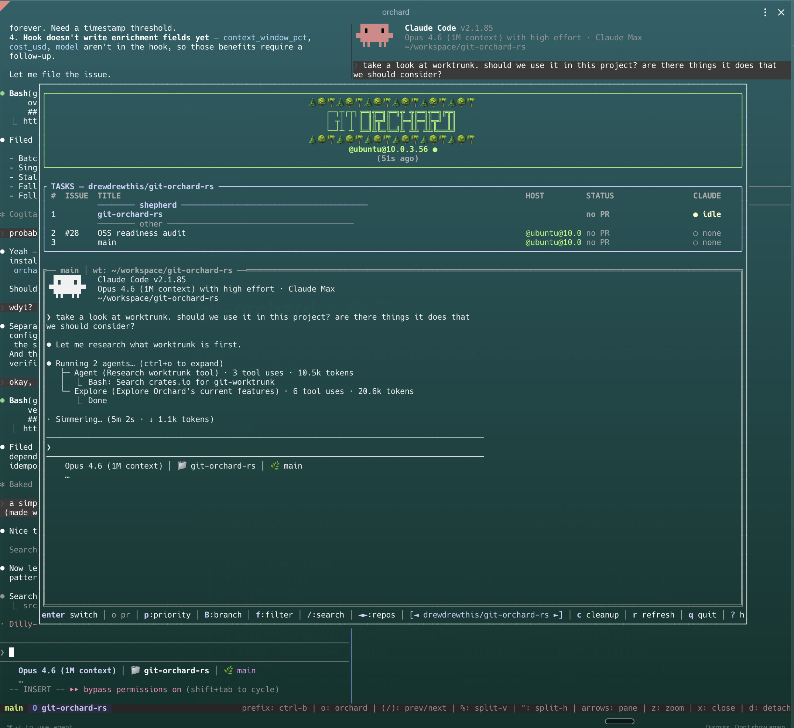

# git-orchard 🌲🌳🌴

A command center for managing git worktrees, tmux sessions, GitHub PRs, and Claude Code sessions across multiple repositories.

Built with [Rust](https://www.rust-lang.org/) + [Ratatui](https://ratatui.rs/).

## Polyglot history

This repo is polyglot as of **2026-05-04**:

Per [ADR-013](docs/adr/013-orchard-cli-ecosystem.md), one user-facing
binary `orchard` dispatches to helper binaries under the hood:

- **`orchard`** (`crates/orchard-dispatcher`) — thin Rust dispatcher.
  Routes verbs to helpers (`orchard tui` → `orchard-tui`, etc.).
  This is the only binary users invoke directly.
- **`orchard-tui`** (`crates/orchard`, `crates/orchard-gui`) — TUI / GUI
  / `--json` worktree manager. Build with `make rust` →
  `target/release/orchard-tui`.
- **`orchard-daemon`** (`cmd/orchard-daemon`, `internal/`) — Go GraphQL
  daemon introduced in [ADR-011](https://github.com/drewdrewthis/orchard-codex/blob/main/adrs/011-orchard-node-model-and-providers.md):
  a read-only join layer over git, tmux, claude, and processes,
  exposed over `localhost:7777`. Build with `make daemon` →
  `bin/orchard-daemon`. Run `bin/orchard-daemon daemon start` (or
  `orchard daemon start` after install) to bring it up,
  `curl localhost:7777/health` to probe.
- **`orchard-worktree`** (`crates/orchard-worktree`) — worktree mutation
  CLI. Dispatched as `orchard worktree …` and via bare-verb shortcuts
  (`orchard new <issue>`, `orchard rm <id>`, etc.).

Renamed to `orchardist` on 2026-06-09; the old URL
redirects. The repo is polyglot (Rust + Go) — the binaries are `orchard`,
`orchard-tui`, `orchard-daemon`, and `orchard-worktree`. See `scripts/init/`
for launchd / systemd units.

The schema lives in `schema.graphql` at the repo root — schema-first.
Run `make generate` to regenerate Go types from it. The Rust TUI client
will codegen from the same file.


📰 **Blog:** [Grow the Orchard](https://growtheorchard.substack.com/)

## What it does

Orchard gives you a single dashboard showing everything happening across your repos: which worktrees have PRs, what state they're in, which Claude sessions are working/idle/waiting for input, and what needs your attention.



## Features

- **Unified dashboard** — worktrees, PRs, issues, tmux sessions, and Claude state in one view
- **Multi-repo** — switch between projects with left/right arrows
- **Claude Code integration** — see which sessions are working, idle, or waiting for input via hooks
- **Smart grouping** — shepherd (main sessions), needs attention, claude working, ready to merge, other
- **Priority toggle** — flag worktrees as priority to keep them at the top
- **PR status** — review decisions, CI checks, merge conflicts, unresolved threads
- **Issue state** — closed issues flagged for cleanup
- **Cleanup** — select and delete worktrees with merged PRs or closed issues
- **Click-to-switch notifications** — desktop notifications when Claude finishes; click to jump to the session
- **Remote worktrees** — manage worktrees on remote machines via SSH, with reachability indicators
- **JSON output** — `orchard-tui --json` returns complete, fresh data for scripting
- **Auto-refresh** — background refresh with two-phase loading (fast locals, then slow remotes)
- **Mouse support** — click to select worktrees, scroll to navigate
- **Transfer** — push/pull worktrees between local and remote machines
- **Self-healing** — `orchard-tui heal` audits and repairs drifted state
- **Theme system** — centralized semantic color definitions for consistent styling

## Install

### From source

```bash
cargo install --git https://github.com/drewdrewthis/orchardist orchard --bin orchard-tui

# Or from a local checkout:
cargo install --path crates/orchard --bin orchard-tui
```

The Rust TUI binary is named `orchard-tui` so it can coexist with the
Go daemon's `orchard` CLI on the same `$PATH`.

### Setup

```bash
orchard-tui init
```

This will:
1. Add the `orchard` shell function to your rc file (launches inside tmux)
2. Set up a tmux keybinding (default: `Ctrl-o`)
3. Optionally add orchard status to your tmux status bar
4. Install Claude Code hooks for session state detection

## Usage

```
orchard-tui                    Interactive dashboard
orchard-tui cleanup            Jump straight to cleanup view
orchard-tui heal               Audit state for drift (dry-run by default)
orchard-tui heal --fix         Apply repairs
orchard-tui setup-remote HOST  Provision a remote host for SSH worktrees
orchard-tui init               Setup wizard
orchard-tui --json             Full state as JSON (always fresh, never cached)
orchard-tui --schema           Print the JSON Schema for --json output and exit
```

### Agent-oriented output

`--json` is the single wire format. Agents that want a token-efficient
encoding should pipe through [`@toon-format/cli`](https://www.npmjs.com/package/@toon-format/cli):

```sh
npm i -g @toon-format/cli
orchard-tui --json | jq '.repos' | toon
```

`--schema` emits the JSON Schema for `--json` output — field names
(post-camelCase), enum string values, and nullability. Agents should read
it before writing jq filters so they target the real wire format instead
of guessing from Rust types:

```sh
orchard-tui --schema | jq '.properties | keys'
# ["hosts", "repos", "tmuxSessions", "version"]
```

The schema is generated at build time from the same types the binary
serializes, and CI fails if the committed `crates/orchard/schema.json`
drifts from the live types.

### Keybindings

| Key | Action |
|-----|--------|
| `↑/↓` or `j/k` | Navigate worktrees |
| `←/→` | Switch between repos |
| `Enter` | Switch to tmux session (creates one if needed) |
| `1-9` | Jump to worktree by number |
| `o` | Open PR in browser |
| `i` | Open issue in browser |
| `p` | Toggle priority flag |
| `d` | Delete worktree |
| `n` | New worktree |
| `t` | Transfer worktree (push/pull to remote) |
| `c` | Cleanup stale worktrees |
| `f` | Cycle filter mode |
| `/` | Search |
| `r` | Refresh |
| `R` | Reconnect (SSH) |
| `?` | Help |
| Mouse click | Select worktree |
| Mouse scroll | Navigate list |
| `q` | Quit |

## Configuration

### Global config

`~/.orchard/config.json` — register multiple repos:

```json
{
  "repos": [
    {
      "slug": "owner/repo",
      "path": "/path/to/repo",
      "remotes": [
        {
          "name": "gpu",
          "host": "user@server",
          "path": "/remote/path",
          "shell": "ssh"
        }
      ]
    }
  ],
  "tmux_sessions": [
    {
      "name": "shepherd",
      "command": "claude --continue",
      "cwd": "/path/to/repo",
      "start_on_launch": true
    }
  ]
}
```

If no global config exists, orchard auto-detects the current repo via `gh repo view`.

### Per-repo config

`.orchard.json` in the repo root (committable, team-shared):

```json
{
  "ci": {
    "ignore": ["codecov/patch", "deploy-preview"],
    "required": ["test", "build"]
  }
}
```

`.git/orchard.json` for local-only overrides (remotes, personal preferences).

See [ADR-003](docs/adr/003-per-repo-config.md) for the full design.

## Architecture

Orchard follows a **Functional Core, Imperative Shell** pattern:

- **Source modules** fetch data from git, GitHub, tmux, SSH, and Claude hooks
- **`build_state()`** is a pure function that joins all sources into a single `OrchardState`
- **TUI** and **`--json`** both consume the same `OrchardState`

See [docs/architecture.md](docs/architecture.md) for the full architecture guide.

## The Orchardist (optional)

> **Optional power-user workflow.** Orchard is a fully functional worktree, PR, and session dashboard on its own. The orchardist is an advanced layer on top — skip this section unless you want it.

The **orchardist** is a persistent Claude Code session attached to a repo that acts like an always-on engineering lead: it reviews PRs, launches worktrees for issues, drives sessions to green, and keeps the orchard tidy. It lives in a dedicated tmux session that orchard starts and reconnects to automatically, so it's always one keystroke away from the dashboard.

### Easy setup

The recommended path is automated — no JSON editing required:

- From a Claude Code session inside the repo, run `/install-orchard` and follow the prompts, **or**
- Re-run `orchard-tui init`, which can offer to configure an orchardist for you.

Either option writes the right `tmux_sessions` entry into your config and starts the session.

### Using it

Once configured, the orchardist shows up as a row in the orchard dashboard:

- Press **Enter** on the orchardist row to jump straight into its tmux session.
- Delegate work with slash commands:
  - `/launch <issue>` — create a worktree and Claude session for a GitHub issue
  - `/drive-pr <pr>` — loop a PR to green (fix CI, address review comments)
  - `/orchard-view` — dashboard view of active worktrees
  - `/prune` — clean up stale worktrees and dead sessions
  - `/recover` — self-heal after a reboot or crash

### Manual config (reference)

If you'd rather configure it by hand, add a `tmux_sessions` entry to `~/.orchard/config.json`:

```json
"tmux_sessions": [
  {
    "name": "shepherd",
    "command": "claude --continue",
    "cwd": "/path/to/repo",
    "start_on_launch": true
  }
]
```

- `name` — tmux session name shown in the dashboard.
- `command` — command to run in the session (`claude --continue` resumes the last conversation).
- `cwd` — working directory for the session (usually the repo root).
- `start_on_launch` — if `true`, orchard starts the session automatically when it launches.

This is the same snippet the automated setup writes for you; edit it only if you want to customize what the skill produces.

## Claude Code Integration

Orchard detects Claude session state via hooks (not terminal scraping):

```bash
orchard-tui init  # installs hooks automatically
```

The hooks write structured JSON on every Claude event (tool use, stop, notification). Orchard reads these for accurate working/idle/input detection, plus context window usage and cost tracking.

## Requirements

- Git
- tmux
- [GitHub CLI](https://cli.github.com/) (`gh`) — for PR/issue data
- [terminal-notifier](https://github.com/julienXX/terminal-notifier) — for click-to-switch notifications (optional, falls back to osascript)

## License

MIT
